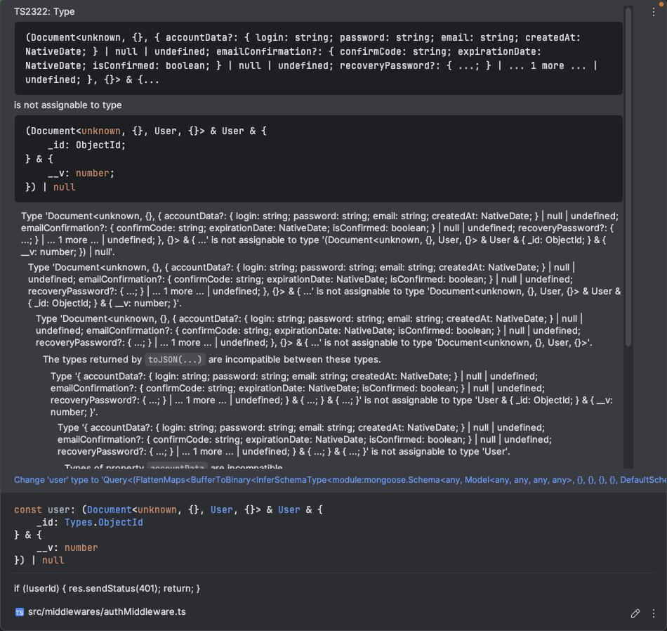
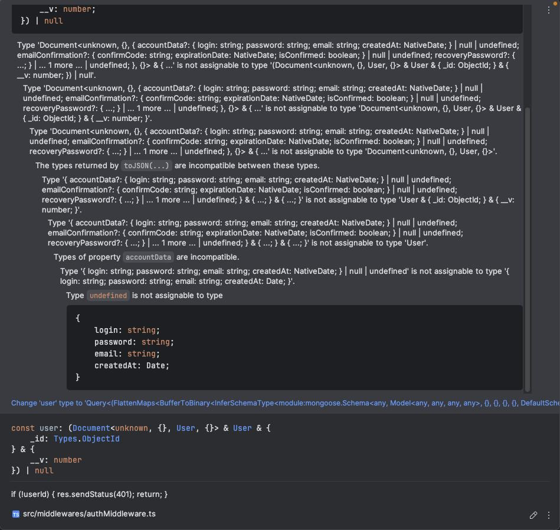
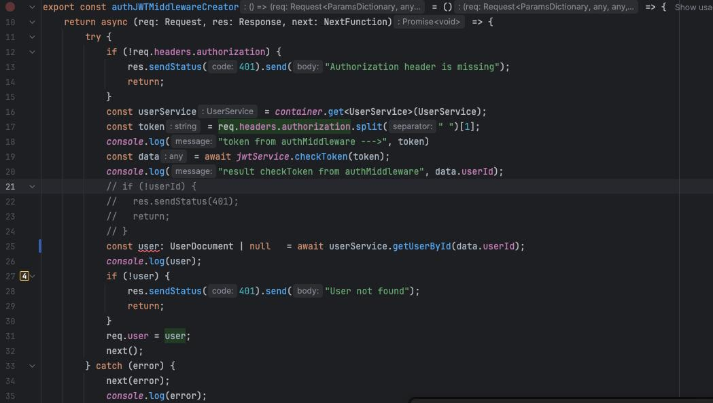

# студент при попытке получить пользователя по айди поолучал ошибку
pt 1.

pt 2.


# его код: 



код с ошибкой 
```
import {Schema, model, HydratedDocument} from "mongoose";

interface User {
    accountData: {
        login: string;
        password: string;
        email: string;
        createdAt: Date;
    },
    emailConfirmation: {
        confirmCode: string;
        expirationDate: Date;
        isConfirmed: boolean;
    },
    recoveryPassword: {
        recoveryPasswordCode: string;
        expirationDate: Date;
    }
}

const userSchema = new Schema({
    accountData: {
        login: { type: String, required: true },
        password: { type: String, required: true },
        email: { type: String, required: true, isEmail: true },
        createdAt: { type: Date, default: Date.now },
    },
    emailConfirmation: {
        confirmCode: { type: String, required: true },
        expirationDate: { type: Date, required: true },
        isConfirmed: { type: Boolean, default: false },
    },
    recoveryPassword: {
        recoveryPasswordCode: { type: String },
        expirationDate: { type: Date },
    },
});

export const UserModel = model("User", userSchema);
export type UserDocument = HydratedDocument<User>;
```

исправление 
помогла строгая типизация RawDocType дженерика у схемы

```
import {Schema, model, HydratedDocument} from "mongoose";

interface User {
    accountData: {
        login: string;
        password: string;
        email: string;
        createdAt: Date;
    },
    emailConfirmation: {
        confirmCode: string;
        expirationDate: Date;
        isConfirmed: boolean;
    },
    recoveryPassword: {
        recoveryPasswordCode: string;
        expirationDate: Date;
    }
}

const userSchema = new Schema<User>({
    accountData: {
        login: { type: String, required: true },
        password: { type: String, required: true },
        email: { type: String, required: true, isEmail: true },
        createdAt: { type: Date, default: Date.now },
    },
    emailConfirmation: {
        confirmCode: { type: String, required: true },
        expirationDate: { type: Date, required: true },
        isConfirmed: { type: Boolean, default: false },
    },
    recoveryPassword: {
        recoveryPasswordCode: { type: String },
        expirationDate: { type: Date },
    },
});

export const UserModel = model("User", userSchema);
export type UserDocument = HydratedDocument<User>;
```